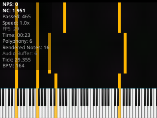
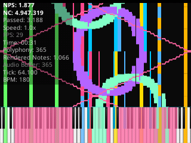

<div align="center">

# Piano From Above (FPA) for KaiOS


<p>
  
  
  
</p>

</div>

**Piano From Above (FPA)** for **KaiOS 2.5** is a MIDI visualizer optimized for smart feature phones (Nokia 2720 Flip, Nokia 8000 4G, Nokia 6300 4G, Nokia 8110 4G, JioPhone, etc.).

<p align="center">
  
  
</p>

This project focuses on optimizing the Canvas rendering pipeline to smoothly display high-density **Black MIDI** tracks with massive note counts on hardware-constrained KaiOS 2.5 devices.

---

## Key Features

* **Black MIDI Optimization:** Lightweight rendering algorithms handle tens of thousands of notes without severe FPS drops.
* **Physical Keypad Support:** Smooth navigation and control using the D-Pad and number keys.
* **Highly Customizable:** Supports a full 128-key piano display, customizable track colors, and adjustable note falling speeds.
* **WebAudio Synthesizer:** Built-in lightweight audio synth that minimizes RAM usage on low-end devices.

---

## Installation Guide for KaiOS 2.5 (Sideloading)

To install this app on your KaiOS 2.5 device, choose **one of the two methods** below:

### Prerequisites
Enable **Debug Mode** on your KaiOS 2.5 phone:
1. Open the Phone app and dial: `*#*#33284#*#*` *(a bug icon will appear in the status bar)*.
2. Or go to **Settings > Device > Developer > Debugger > Select ADB & DevTools**.

---

### Method 1: WebIDE / Waterfox Classic (For Developers & Direct Sideloading)

1. **Preparation:**
   * Download [ADB Platform Tools](https://developer.android.com/studio/releases/platform-tools) on your computer.
   * Download a WebIDE-compatible browser like **Waterfox Classic** or **Firefox v59 / ESR 52**.
2. **Connect Phone to PC:**
   * Connect your phone to your PC via USB cable.
   * Open Terminal / Command Prompt and verify the connection:
     ```bash
     adb devices
     ```
   * Forward the debugger port (for KaiOS 2.5):
     ```bash
     adb forward tcp:6000 localfilesystem:/data/local/debugger-socket
     ```
3. **Install Application:**
   * Open **Waterfox Classic / Firefox** and press `Shift + F8` to open **WebIDE**.
   * In the right panel, select **Remote Runtime** (Port `6000`).
   * In the left panel, select **Open Packaged App...** and select your project folder (containing `manifest.webapp`).
   * Click the **Play** (Triangle) button in the top toolbar to build and run the app directly on your phone.

---

### Method 2: OmniSD / Gerda File Manager / Wallace Toolbox (.zip File)

1. **Package the App:**
   * Zip all files in the project folder (including `manifest.webapp`, `index.html`, `js/`, `css/`, `icons/`, etc.) into a `.zip` archive (e.g., `fpa-kaios.zip`).
   * *Note:* Zip the contents directly inside the project root, not the parent folder itself.
2. **On your Phone:**
   * Copy `fpa-kaios.zip` to your SD card or internal storage.
   * Open **OmniSD**, **Gerda File Manager**, or **Wallace Toolbox** on KaiOS 2.5.
   * Select `fpa-kaios.zip` and press **Install**.
   * Once installed, **Piano From Above** will appear on your app launcher menu.

---

## Contributing

Contributions to optimize Canvas rendering performance or reduce memory consumption for massive Black MIDI files are highly appreciated!

1. Fork this repository.
2. Create a feature branch (`git checkout -b feature/OptimizeCanvas`).
3. Commit your changes (`git commit -m 'Optimize frame rendering time'`).
4. Push to the branch (`git push origin feature/OptimizeCanvas`).
5. Open a **Pull Request**.

---

## License

This project is released under the [MIT License](LICENSE).
